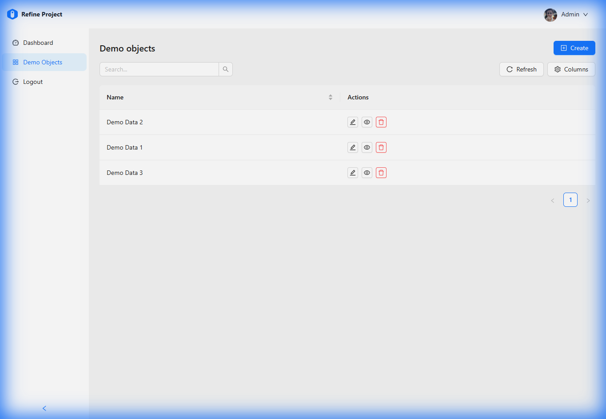

# Cundi

Cundi is a modern full-stack application combining a robust .NET backend with a responsive React frontend.



## Overview

This project demonstrates a Headless CMS architecture using **DevExpress XAF** for the backend API and **Refine** for the frontend UI. It features a complete authentication flow across both layers and reusable components for rapid development. For detailed development guidelines, best practices, and architecture details, please refer to the [Development Guide](./Development_Guide.md).

## Technology Stack

### Backend (`cundiapi`)
-   **Framework**: .NET 9
-   **Core Library**: DevExpress XAF (Headless Web API)
-   **ORM**: XPO (eXpress Persistent Objects)
-   **API Protocol**: OData v4
-   **Features**:
    -   JWT Authentication
    -   Integrated Security System
    -   Swagger UI for API documentation

### Frontend (`cundiweb`)
-   **Framework**: React 19
-   **Build Tool**: Vite
-   **Metasystem**: [Refine](https://refine.dev/)
-   **UI Library**: Ant Design
-   **Core SDK**: `@cundi/xaf-refine-sdk`
-   **Features**:
    -   **SmartList**: A powerful, reusable list component with built-in search, sorting, and column management (via SDK).
    -   **RelatedList**: Specialized component for Master-Detail relationships (via SDK).
    -   Role-based Access Control (RBAC).

## Getting Started

### Prerequisites
-   .NET SDK (6.0 or later)
-   Node.js (LTS version recommended)

### 1. Start the Backend

 Navigate to the backend directory and run the application:

```bash
cd cundiapi
dotnet restore
dotnet run
```

The API will be available at `http://localhost:5000` (or `https://localhost:5001`).
*Note: Ensure the backend is running before starting the frontend.*

### 2. Start the Frontend

Navigate to the frontend directory, install dependencies, and start the development server:

```bash
cd cundiweb
npm install
npm run dev
```

The application will launch at `http://localhost:5173`.

## Key Features

-   **DemoObject CRUD**: A fully functional example resource demonstrating Create, Read, Update, and Delete operations.
-   **User Management & Role Assignment**:
    -   Administrators can manage Application Users and Roles.
    -   Support for assigning multiple Roles directly from the User Edit page.
    -   **Advanced Role-based Access Control**:
        -   Support for granular **Type Permissions** (configuring Read, Write, Create, Delete access per Business Object).
        -   Dynamic loading of system types for permission configuration.
        -   Solves complex OData nested serialization and XAF security compatibility issues (detailed in Development Guide).
-   **Authentication**: Secure login utilizing JWT tokens issued by the backend.
-   **Clean Architecture**: Separation of concerns between API definitions and UI logic.
