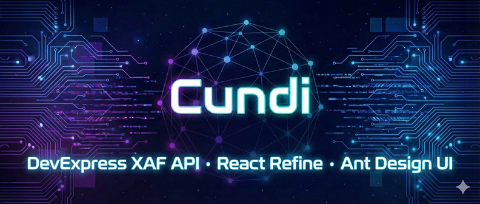
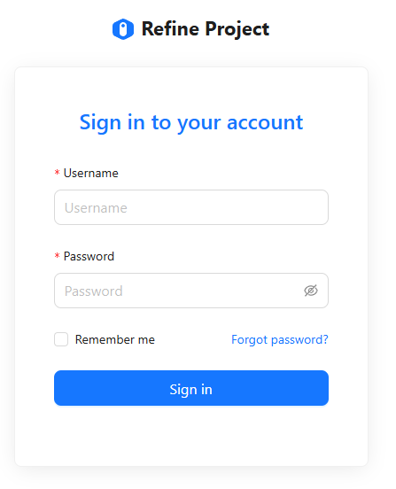
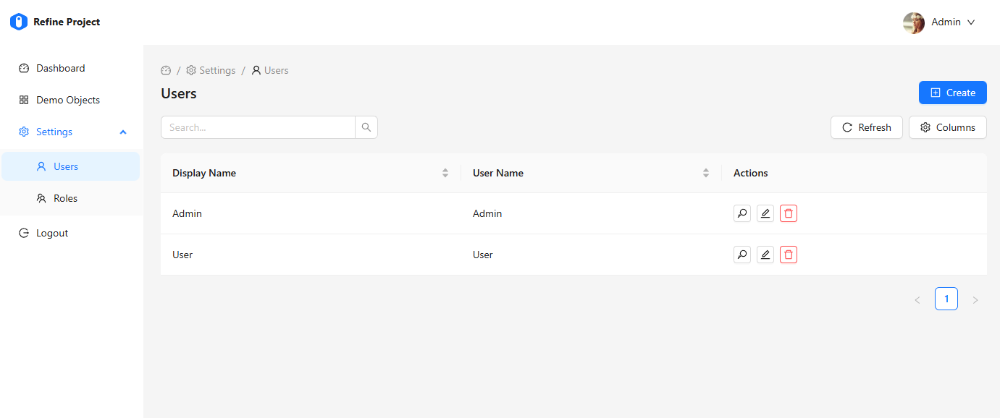
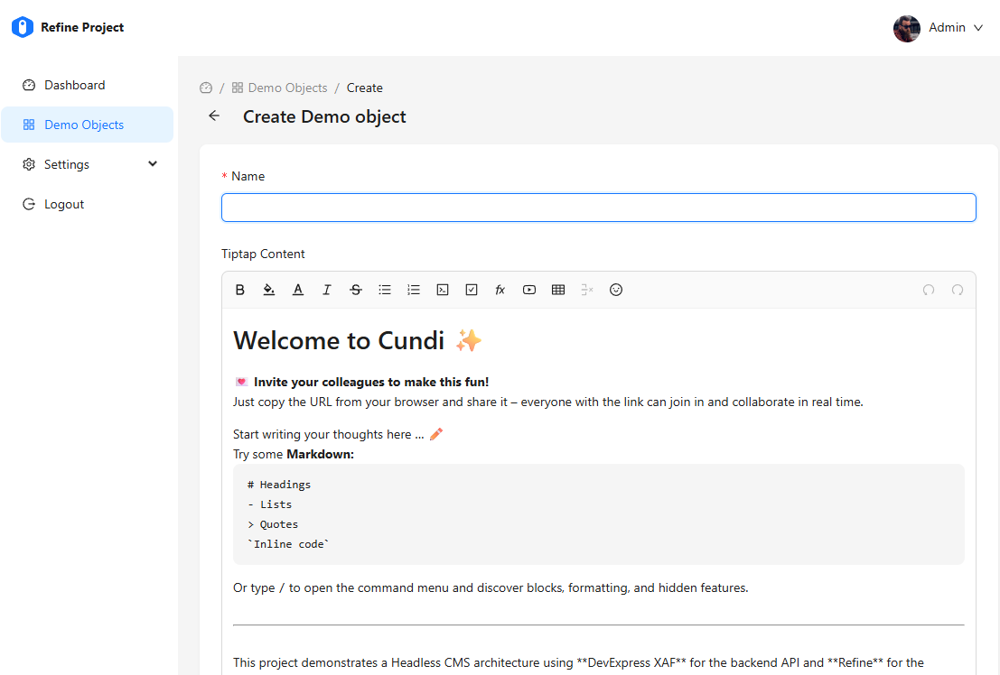

# Cundi

Cundi 是一個結合了強大 .NET 後端與響應式 React 前端的現代化全端應用程式。



## 專案概覽

> [English](./README.md)


本專案展示了使用 **DevExpress XAF** 作為後端 API 以及 **Refine** 作為前端 UI 的 Headless CMS 架構。它具備完整的跨層身分驗證流程，並包含便於快速開發的可重複使用元件。有關詳細的開發指南、最佳實踐與架構細節，請參閱 [開發指南](./Development_Guide.md)。

## 技術堆疊

### 後端 (`cundiapi`)
-   **框架**: .NET 9
-   **核心庫**: DevExpress XAF (Headless Web API)
-   **ORM**: XPO (eXpress Persistent Objects)
-   **API 協定**: OData v4
-   **功能**:
    -   JWT 身分驗證
    -   整合式安全系統 (Integrated Security System)
    -   Swagger UI API 文件
    


### 前端 (`cundiweb`)
-   **框架**: React 19
-   **建置工具**: Vite
-   **中台框架**: [Refine](https://refine.dev/)
-   **UI 函式庫**: Ant Design
-   **核心 SDK**: `@cundi/refine-xaf` (若需從頭建立，請參閱 [開發指南](./Development_Guide.md#appendix-creating-frontend-from-scratch))
-   **功能**:
    -   **SmartList**: 強大且可重複使用的列表元件，內建搜尋、排序與欄位管理功能 (via SDK)。
        
    -   **RelatedList**: 專為 Master-Detail (主從) 關係設計的元件 (via SDK)。
    -   以角色為基礎的存取控制 (RBAC)。

## 使用範本 (cundiapi)

您可以使用內建的 `dotnet new` 範本快速建立新的後端專案。

### 安裝範本

若要從 NuGet 安裝範本，請執行以下指令：

```bash
dotnet new install Cundi.Api.Template
```

### 建立新後端專案

安裝完成後，使用以下指令建立新專案：

```bash
dotnet new cundiapi -n 您的專案名稱
```

這將會建立一個名為 `您的專案名稱` 的新資料夾，並將所有命名空間與檔案名稱自動重新命名。

## 快速開始

### 前置需求
-   .NET SDK (6.0 或更新版本)
-   Node.js (建議使用 LTS 版本)

### 1. 啟動後端

進入後端目錄並執行應用程式：

```bash
cd cundiapi
dotnet restore
dotnet run
```

API 將會在 `http://localhost:5000` (或 `https://localhost:5001`) 啟動。
*注意：請確保在啟動前端之前，後端已經在執行中。*

### 2. 啟動前端

進入前端目錄，安裝相依套件並啟動開發伺服器：

```bash
cd cundiweb
npm install
npm run dev
```

應用程式將會在 `http://localhost:5173` 啟動。

## 主要功能

-   **DataTypeExample**: 一個綜合範例，展示了各種 XPO 資料型別 (字串、整數、列舉、圖片、檔案) 及其對應的前端編輯器。
-   **使用者管理與角色指派**:
    -   管理員可管理使用者 (Application Users) 與角色 (Roles)。
    -   支援在使用者編輯頁面直接指派多個角色 (Roles)。
    -   實作了安全的密碼重置與複雜密碼生成功能。
        
    -   **進階角色權限控制 (Advanced RBAC)**:
        -   支援細緻的 **Type Permissions** 設定 (針對個別業務物件設定讀、寫、建立、刪除權限)。
        -   動態載入系統類型 (Business Object Types) 以供設定。
        -   解決了複雜的 OData 巢狀序列化與 XAF 安全性相容問題 (詳見開發指南)。
-   **身分驗證**: 使用由後端發出的 JWT Token 進行安全登入。
-   **整潔架構**: 清楚分離 API 定義與 UI 邏輯。
-   **Tiptap Editor**: 豐富的文字編輯器支援。
    
